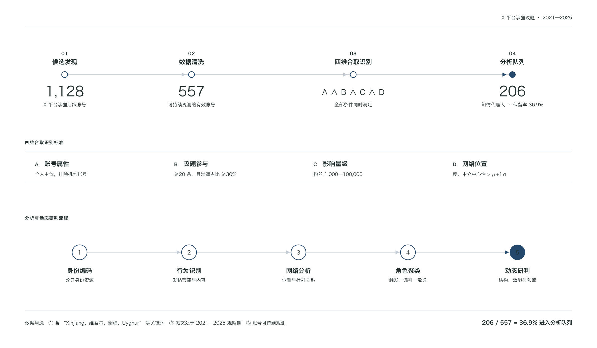
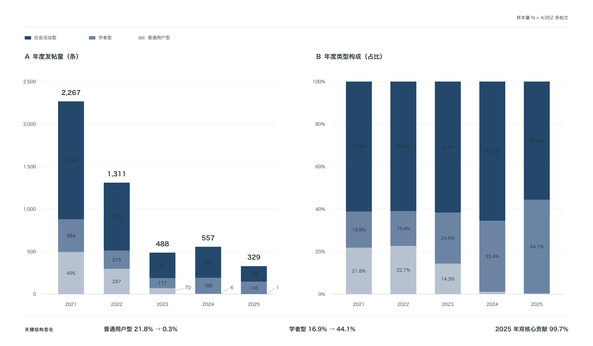
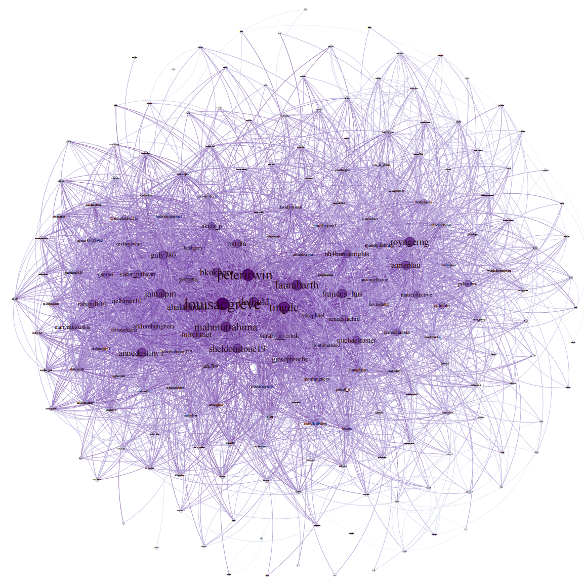
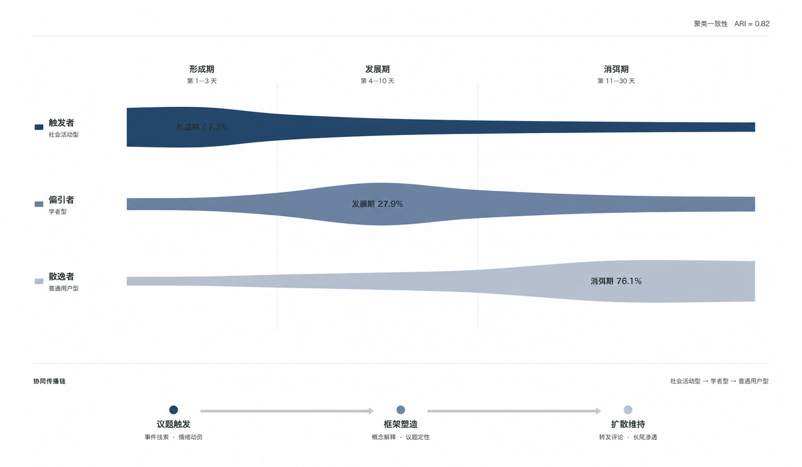
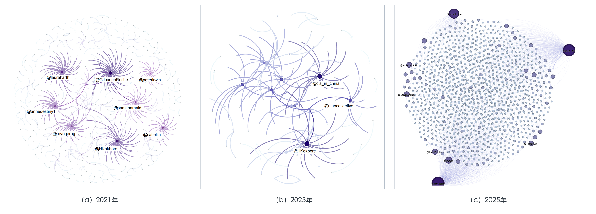

# 境外社交平台涉华舆情知情代理人的识别与网络互动

## ——基于 X 平台涉疆议题 2021—2025 年的纵向研究

**新媒体2401 李荣 2244313043**

## 摘要

**【目的/意义】** 境外社交平台中的涉华舆论主体已由机构账号和头部意见领袖延伸至大量低可见度个体节点。现有研究对介于头部账号与一般用户之间、持续参与特定议题并占据相对有利网络位置的主体，尚缺乏兼顾身份、行为与关系的纵向识别框架。**【方法/过程】** 以 2021 年 1 月 1 日至 2025 年 12 月 31 日 X 平台涉疆议题为研究场景，依据账号属性、议题参与、影响力量级和网络位置四维标准识别出 206 个知情代理人样本，综合运用内容编码、社会网络分析、K-means 聚类和事件阶段比较，考察其身份结构、行为节律、关系网络、角色分工与传播效能。**【结果】** 涉疆舆情场知情代理人形成“核心稳固、边缘弥散”的小世界网络结构，五年间呈现规模收缩、核心节点影响力持续扩大、网络连接密度稳步提升、群体隐蔽性不断增强的演化趋势；群体内部分工稳定，社会活动型、学者型、普通用户型主体分别承担“触发者”“偏引者”“散逸者”职能，阶段性接力协同的传播模式具有跨时间稳定性；圈层内说服效果显著，但整体破圈能力有限且持续弱化；不同类型主体说服力分化加剧，社会活动型影响力持续扩大，学者型主体公信力持续下降，普通用户型主体则逐渐隐匿。**【结论】** 本文将知情代理人研究从仿真场景拓展至真实舆情场的纵向追踪，所构建的识别指标体系可对多议题境外舆情监测提供借鉴；演化规律总结可为隐匿舆情主体动态追踪、风险预警与分层治理提供参考。

**关键词：** 境外涉华舆情；知情代理人；主体识别；社交网络分析；纵向研究

## Identification and Network Interaction of Informed Agents in Overseas China-related Public Opinion

### A Longitudinal Study of Xinjiang-related Discussions on X, 2021—2025

**Abstract:** **[Purpose/Significance]** The actors shaping China-related public opinion on overseas social platforms have expanded from institutional accounts and prominent opinion leaders to numerous low-visibility individual nodes. Existing research still lacks a longitudinal identification framework that integrates identity, behavior, and relational position for actors situated between highly visible accounts and ordinary users who participate continuously in specific issues and occupy relatively advantageous network positions. **[Method/Process]** Using Xinjiang-related discussions on X from 1 January 2021 to 31 December 2025 as the empirical setting, this study identifies 206 informed agents through four dimensions—account attributes, issue engagement, influence scale, and network position—and combines content coding, social network analysis, K-means clustering, and event-stage comparison to examine their identity structure, behavioral rhythms, relational networks, role differentiation, and communication effectiveness. **[Results]** The informed agents form a small-world network characterized by a stable core and dispersed periphery. Across the five years, the group contracts in scale while the influence of core nodes expands, network density increases steadily, and concealment intensifies. A stable division of labor emerges: social-activist, scholar, and ordinary-user accounts act respectively as initiators, shapers, and diffusers, forming a temporally stable relay pattern across stages. Persuasion within the network is substantial, whereas cross-community reach remains limited and continues to weaken. Persuasive effectiveness also diverges across account types: the influence of social-activist accounts continues to expand, the credibility of scholar accounts declines, and ordinary-user accounts gradually recede from view. **[Conclusion]** This study extends informed-agent research from simulated settings to longitudinal observation in a real-world public-opinion environment. The proposed identification framework can inform multi-issue monitoring of overseas public opinion, while the observed evolutionary patterns provide a reference for dynamically tracking covert actors, issuing risk warnings, and applying differentiated governance.

**Keywords:** overseas China-related public opinion; informed agents; actor identification; social network analysis; longitudinal research

## 0 引言

平台化传播重组了国际舆论场的主体结构。传统的涉华舆情研究通常把政府、媒体、智库、专家和头部意见领袖视为主要影响节点，但算法分发、关注网络与互动推荐使大量个体账号获得了跨圈层参与公共议题的机会。与身份清晰、可见度较高的机构主体相比，这些个体节点单独看并不突出，却可能依靠持续发声、议题专注和关系嵌入形成群体性结构效应。围绕国际舆论博弈、涉华议题传播、“中国通”网络与社交机器人，国内研究已经注意到传播主体多元化、互动网络化和策略复合化的趋势[1-8]，但对低可见度个体节点的识别仍多依赖经验判断或单一影响力指标。

“知情代理人”（informed agent）为理解这类中间主体提供了理论入口。该概念最初用于解释掌握方向性信息的少数个体如何影响群体决策，随后被意见动力学研究引入社会网络，讨论知情主体的数量、位置和目标对群体意见演化的影响[9-14]。与传统意见领袖相比，知情代理人的理论特征并非单纯拥有高粉丝量或高曝光度，而是以相对普通的身份进入群体互动，持续参与特定议题，并凭借信息、立场或网络位置影响传播方向。

随着国际舆论博弈向隐蔽化、精准化和算法化转变，头部意见领袖受到的监测与制约不断增加，境外政治力量因而更重视寻找与培育能够潜隐于普通用户之中的中间主体。知情代理人正是被雇佣或选择、通过预设观点引导社会舆论走向的普通个体。其通常以分散身份嵌入群体互动，通过持续议题参与、观点协同和关系渗透逐步改变周围人的认知。本文以多项公开指标将这类隐匿主体转化为可识别、可追踪和可研判的实证对象。

基于此，研究以知情代理人的识别与动态研判为核心问题，构建多维识别指标体系，并以 X 平台 2021—2025 年涉疆议题为纵向实证场景，重点回答三个问题：

　　Q1：如何构建境外社交平台舆情知情代理人的可操作化识别指标体系？

　　Q2：知情代理人群体具有怎样的网络结构特征与角色分工特点？

　　Q3：五年间该群体呈现何种演化规律？对境外舆情情报监测与风险预警有何应用价值？

本研究一方面将知情代理人理论从仿真场景与静态分析拓展至真实舆情场的纵向追踪，另一方面为境外隐匿舆情主体的精准识别与动态治理提供方法路径与经验依据。具体而言，研究以五个完整自然年为时间切片，将身份、行为、网络和评论效果纳入同一分析框架，揭示知情代理人从个体隐匿、网络嵌入到角色协同的组织化传播机制，并把长期小世界网络演化与事件期分层接力纳入统一解释链条。

## 1 相关研究综述

### 1.1 境外舆情主体识别的研究进展

境外舆情主体识别是舆情情报研判的基础环节，现有研究重点关注意见领袖和关键节点识别。Borgatti从网络干预目标出发区分关键节点集合，指出最优节点并不必然等同于单个中心性最高的节点[15]；Valente 和 Pumpuang 梳理了同伴提名、观察、职位、专家判断、自我选择和网络测量等意见领袖识别方法，说明不同方法对应不同的“影响力”概念[16]。Nisbet 和 Kotcher 将意见领袖识别用于气候传播，强调议题情境与社会关系的重要性[17]；Haenlein 和 Libai 则从市场扩散角度讨论高收入引领者的识别与定向触达[18]。这些研究共同表明，影响者识别不能只依赖粉丝量、转发量或某一个中心性指标，而应先回答“在何种议题、对何种群体、通过何种关系产生何种影响”。

议题显著性研究与经典传播理论为理解舆论议题及意见影响提供了基础[19-20]；此后的应用研究和方法综述，则进一步把意见领袖识别概括为网络拓扑、扩散过程、内容特征和混合方法等路径[21-22]。网络拓扑方法便于处理大规模关系数据，但容易把结构位置等同于实际说服力；内容和互动方法能够观察议题专注与受众反馈，却可能受到事件热度和平台可见度影响。因此，较稳妥的识别方式应将账号属性、议题行为、影响力量级和关系位置结合起来，并在不同时间切片中复核其稳定性。

在境外涉华舆论研究中，主体识别已从传统媒体和头部意见领袖扩展到“中国通”、社交机器人及普通用户。关于英国和全球“中国通”的研究借助社会网络分析识别影响节点及结构洞位置，揭示专业身份与网络位置的结合方式[2,5]；涉华人权议题与 Twitter 中国议题研究则运用机器人检测、行为特征和互动网络识别自动化或半自动化账号[6-7,23]。这些工作显著提升了主体识别的计算化程度，但机器人识别回答的是“账号是否具有自动化行为”，并不能覆盖所有由真人运营、身份普通但持续参与议题的节点。刘媛菁、宋文强的相关研究进一步强化了对算法动员机制和事件阶段的解释，他们以俄乌冲突为案例，将算法介入拆解为“数据捕获—内容生产—渠道控制—效果强化”的全链路，并以“认知闭合—失调—再闭合”解释不同阶段的认知形塑[24]。这一研究说明，舆论动员不是单次内容投放，而是主体、平台与叙事在不同阶段的连续配合；但其分析重点仍是国家动员体系，对低可见度个体节点的长期识别与网络协同尚未展开。

另一条路径关注突发事件中的多元主体和专业意见领袖。博弈演化研究强调媒体、政府、网民等主体在不同阶段采取不同策略[25]；专业意见领袖研究则指出，网络场域的分散化和扁平化可能削弱单一权威的稳定性[26]。国际分众舆情分析进一步证明，大规模网络社群划分可以识别不同受众群体及其关系结构[27]。总体来看，现有研究主要围绕传统意见领袖、社交机器人和普通网民群体三类主题展开了丰富的研究，但对“非头部、非机构、非机器人而又具有持续议题参与和相对网络优势”的个体主体，仍缺少清晰的操作性类别。

随着舆情博弈向隐蔽化发展，研究者开始关注介于意见领袖与普通网民之间的中间主体。相德宝、李馥琼对英国“中国通”的社交媒体网络分析发现，该群体形成较为紧密的核心—边缘关系网，媒体记者等主体发挥了重要的信息中介作用[2]。这说明专业身份与关系位置相结合能够形成群体性影响，但既有研究尚未解决非头部个体的识别标准与长期行为机制问题。整体来看，现有舆情主体识别研究呈现“重头部、轻隐匿，重截面、轻追踪”特征，对兼具隐蔽性与影响力的知情代理人缺乏长期动态观察。

### 1.2 知情代理人研究脉络与局限

知情代理人研究建立在社会影响和意见动力学传统之上。French的社会权力模型揭示了个体影响权重的差异[28]，DeGroot共识模型则以迭代平均说明互动关系如何推动意见收敛[29]。在此基础上，后续研究把多维意见与认知对齐[30]、态度隐藏[31]、乘性噪声反馈[32]、逆向代理人[33]、顽固代理人[34]、异质信念与极端化[35]以及控制策略[36]纳入模型。相关成果说明，意见演化同时受到初始立场、网络结构、互动规则和行为可见性的影响。

知情代理人的概念原型来自群体决策研究。Couzin等发现，较少数量的知情个体即可影响移动群体的方向，并且群体规模会改变少数信息个体的作用方式[11]。该结论进入社会网络研究后，形成两类问题：一类关注知情代理人的意见如何影响总体意见及极化水平[9,14]；另一类关注知情代理人在网络中的放置位置，特别是度、中介度、接近度与跨社群连接如何改变影响效率[10,12-13]。

国内研究进一步把 Agent 方法用于舆情治理模式比较。刘继、陈艳在Deffuant有限信任模型与BA无标度网络基础上设置网民、媒体和政府等异质主体，对网络自治、政府单边治理与多主体协同治理进行控制变量仿真[37]。这一研究清晰展示了“主体属性—交互规则—观点演化—治理模式比较”的模型逻辑，也从侧面说明：仿真中的主体类型、参数和影响方向由研究者设定，若要解释真实平台，仍需以可观察账号、关系数据和纵向行为加以检验。

然而，仿真研究与现实账号识别之间存在三重断裂。第一，模型把知情状态、目标方向和代理人选择设为已知变量，平台研究却缺少能够直接落地的识别规则。第二，模型通常在稳定网络和统一规则下运行，而真实平台会经历账号进入退出、算法变化和事件冲击。第三，模型中的影响效果可由最终意见分布测量，平台研究则需要同时考察曝光、评论、重复互动和态度反馈。因此，亟须把“被雇佣或选择、通过预设观点引导舆论”的理论定义，转化为真实平台中可复核的身份、行为与网络指标。

### 1.3 社交网络分析在舆情演化研判中的应用

社交网络分析是当前舆情情报研究的主流方法，被广泛应用于主体识别、社群发现、演化规律研判等场景。度中心性反映直接连接数量，接近中心性反映节点到达其他节点的距离效率；中介中心性则衡量节点位于其他节点最短路径上的程度，其经典度量由 Freeman 加以系统化[38]。在舆情研究中，这些指标能够识别内容来源、桥接节点和关系核心，但必须结合边的语义解释：关注、转发、回复、评论和提及是不同关系，不能在不加区分的情况下合并[23]。

整体网络指标则用于判断连接效率和社群结构。网络密度反映实际连接占可能连接的比例，平均路径长度反映节点间可达距离，聚类系数衡量局部闭合程度，模块度衡量社群划分的相对强度。Watts和Strogatz指出，小世界网络同时具有较短的平均路径和较高的局部聚类[39]。这一结构既维持局部圈群的信任与重复互动，又能借助少量跨社群联系完成快速扩散，尤其适合解释隐匿个体以分散身份形成高效协同网络的过程。时序网络研究还表明，边的发生顺序和持续时间会进一步改变扩散路径与结构效能[40]，因此本文通过五个年度快照考察其小世界化演进。

国内网络舆情研究已从舆情混沌与演变模型[41]，推进到事件周期中的角色互动[42]、过程与要素框架[43]以及系统动力学模拟[44]。这些研究说明，舆情主体的作用具有阶段性，同一主体在形成期、发展期和消弭期可能承担不同功能。同时，传播效果不能由单一互动量概括：研究科普期刊传播效果时，孙嘉宇将主体、内容和传播特征结合起来[45]；这提示境外舆情研究也应区分触达范围、互动深度和态度认同。

基于上述研究，本文建立“主体识别—行为节律—网络结构—角色分工—传播效能”的分析链条。主体识别回答“谁进入分析子样本”，行为和网络分析回答“如何参与并与谁连接”，角色分析回答“在事件周期中承担何种功能”，传播效能分析则分别考察评论广度、重复互动和评论倾向。

## 2 研究设计

### 2.1 核心概念界定

“知情代理人”（informed agent）概念最初源自动物行为学研究。Couzin 等发现，在群体移动决策中，少量掌握方向性信息的个体即可影响群体选择，且其数量与群体规模共同作用于决策精度[11]。该概念被引入社会网络与意见动力学后，学者将其定义为“易于被雇佣或选择、通过预设观点引导社会舆论走向特定方向的普通个体”[9-10,12-14]。相较于中心化意见领袖，知情代理人的核心优势在于知名度低、雇佣成本低、行为模式具有可塑性与隐蔽性，能够以相对普通的身份嵌入网络，并借助持续参与和结构位置影响群体信息流动。

结合境外社交平台舆情场的经验特征，本文将“境外社交平台舆情知情代理人”界定为：以普通个体账号为载体，持续聚焦特定涉华议题，观点倾向高度协同，具备跨社群信息传递能力，能够通过隐性互动潜移默化影响公众舆论走向的账号主体。该定义包含四个核心维度：一是身份隐匿性，即账号无官方、媒体或机构认证标识，外观与普通用户接近；二是议题专注性，即跨年度持续关注特定议题，内容产出具有明确且一致的导向；三是网络连接性，即在关注网络中占据有利结构位置，具备跨圈层扩散能力；四是引导隐蔽性，即通过情感共鸣、日常叙事和标签聚合等软性策略完成观点渗透。四重特征共同使知情代理人区别于头部意见领袖、一般用户和社交机器人，构成境外反华舆论动员中具有独特情报价值的行为主体。

本文进一步区分“总体账号样本”和“知情代理人子样本”。总体样本是观察期内具有有效涉疆议题记录并进入研究数据库的 557 个账号；知情代理人子样本是从总体有效样本中，经四维标准筛选后进入核心分析的 206 个账号。557 与 206 并非两个相互竞争的样本量，而是总体与子样本的嵌套关系。

文中“身份类型”指依据公开账号简介、地域与政治身份线索、主页内容及涉疆言论特征形成的人工编码类别；“行为角色”指依据发帖时间、内容类型和网络中心性聚类得到的功能类别。二者分别描述主体的身份资源与实际任务分工，并共同用于识别其在舆论动员链条中的组织位置。

### 2.2 知情代理人识别指标体系构建

知情代理人的识别是本文由理论概念走向真实平台实证的方法核心。指标体系遵循四项原则：一是理论锚定，每项指标均对应个人主体、持续参与、相对影响力或关系嵌入等概念维度；二是公开可得，全部判别均以平台公开字段和可复核内容为依据；三是合取筛选，账号须同时满足各维度而非凭单项高值入选；四是纵向可比，五个年度采用一致字段、计算规则与阈值口径。由此从账号属性、议题参与、影响力量级和网络位置四个维度构建识别指标体系（表 1）。

**表 1　境外涉华舆情知情代理人识别指标体系**

| 一级指标 | 二级指标 | 操作化标准 | 指标含义 | 参考文献 |
|:---|:---|:---|:---|:---|
| 账号属性 | 主体类型 | 个人注册账号；公开资料显示非政府、媒体、NGO、企业等机构名义运营 | 保留个体主体，排除机构化传播账号 | Afshar & Asadpour, 2010[10]；Ghezelbash et al., 2019[13] |
| 议题参与 | 议题发帖量 | 观察期内涉疆议题帖文不少于 20 条 | 排除一次性或偶然参与 | Fan & Pedrycz, 2016[9] |
| 议题参与 | 议题内容占比 | 涉疆内容占账号总发帖量不低于 30% | 保证议题专注度 | Fan & Pedrycz, 2016[9] |
| 影响力量级 | 粉丝数区间 | 1,000—100,000 | 控制账号可见度量级，区分低连接账号与头部意见领袖 | Afshar & Asadpour, 2010[10] |
| 网络位置 | 度中心性 | 高于总体均值 1 个标准差 | 识别直接关系范围相对较大的节点 | AskariSichani & Jalili, 2015[12] |
| 网络位置 | 中介中心性 | 高于总体均值 1 个标准差 | 识别位于较多最短路径上的潜在桥接节点 | AskariSichani & Jalili, 2015[12] |

账号属性是识别的第一道边界。本文依据账号自述、主页名称、认证类别和公开链接判断其是否以机构名义运营，排除政府、媒体、国际组织、企业和 NGO 等机构账号，仅保留个人主体。相较于公开组织账号，个人账号更容易以普通用户身份潜入议题讨论，其去机构化外观正是知情代理人身份隐匿性和低成本运作的重要基础。

议题参与由发帖量和内容占比两个指标共同衡量。涉疆帖文不少于 20 条，用于排除仅在个别事件中偶然出现的账号；涉疆内容占总发帖量不低于 30%，用于区分议题专注账号与泛活跃账号。数量阈值回答“是否持续参与”，比例阈值回答“该议题在账号表达中是否具有足够权重”，二者不能相互替代。阈值依据候选池分布与样本规模平衡确定，跨平台或跨议题使用时应重新校准，而不宜直接照搬。

影响力量级以 1,000—100,000 粉丝为观察区间。下限用于排除连接能力极弱、难以进入稳定互动网络的账号，上限用于控制已形成显著头部效应的意见领袖，使研究对象集中于“具有一定可见度但并非头部”的中间主体。粉丝量只能表示潜在触达规模，既不能单独识别机器账号，也不能直接等同于实际影响力。

网络位置同时考察度中心性与中介中心性。前者反映节点的直接连接范围，后者反映节点位于其他节点最短路径上的程度；本文保留两项指标均高于总体均值1个标准差的账号，以识别在样本网络中具有相对连接优势的节点。该判断依赖网络边界、关系类型和年度结构，因而只表示“在本文网络中的相对位置”，不能脱离具体网络解释为普遍桥接能力。

上述标准构成合取关系。任何单一指标都不能证明账号属于知情代理人：粉丝数只能反映可见度量级，议题发帖量只能反映参与程度，中心性也只能说明结构位置。只有同时满足个人主体性、议题专注性、相对影响力和关系嵌入性要求的账号，才进入后续子样本。该体系的价值在于规则透明、字段可追溯且便于嵌入监测流程；其可迁移性体现为“维度可复用”，而非“阈值可无条件通用”。

依据账号注册区域、使用语言、简介、主页内容的自我呈现与涉疆问题的言论，本研究综合提炼出三层指标以细分知情代理人类型，最终将206个知情代理人样本分为社会活动型、学者型与普通用户型三类。为进一步区分知情代理人的身份资源，本文采用三级判别逻辑进行人工编码，将普通用户型知情代理人细分为六种类型（详见表2）

**表 2　知情代理人身份编码表**

| 一级指标：维度 | 一级指标：判别项 | 二级指标：维度 | 二级指标：判别项 | 三级指标：维度 | 三级指标：判别值 | 编码 | 知情代理人类别 |
|:---|:---|:---|:---|:---|:---|:---:|:---|
| 政治身份 | 疆独/港独/台独相关活动人士 | 呼吁“自由”等政治主张 | — | 有无贬低新疆的言论 | 有 | A | 社会活动型知情代理人 |
| 政治身份 | 反华议题专门研究者 | 具有一定公共知名度 | — | 有无贬低新疆的言论 | 有 | B | 学者型知情代理人 |
| 区域身份 | 外国人 | 对涉疆问题关注度 | 账号简介中不包括涉疆政治内容 | 有无贬低新疆的言论 | 有 | C1 | 其他知情代理人 |
| 区域身份 | 外国人 | 对涉疆问题关注度 | 账号简介中不包括涉疆政治内容 | 有无贬低新疆的言论 | 无 | C2 | 其他知情代理人 |
| 区域身份 | 海外华人 | 对涉疆问题关注度 | 账号简介中不包括涉疆政治内容 | 有无贬低新疆的言论 | 有 | C3 | 其他知情代理人 |
| 区域身份 | 港台华人 | 对涉疆问题关注度 | 账号简介中不包括涉疆政治内容 | 有无贬低新疆的言论 | 有 | C4 | 其他知情代理人 |
| 区域身份 | 不明显 | 对涉疆问题关注度 | 账号简介为政治内容 | 有无贬低新疆的言论 | 自诩为无党派或独立视角 | C5 | 其他知情代理人 |
| 区域身份 | 不明显 | 对涉疆问题关注度 | 账号简介中出现新疆 | 有无贬低新疆的言论 | 有 | C6 | 其他知情代理人 |

注：“—”表示该单元未设置独立判别项。身份判断依据账号公开自述、主页内容与涉疆表达综合编码。

### 2.3 研究场景与数据来源

#### 2.3.1 研究场景的选择依据

本文选择 X 平台涉疆议题作为实证场景，主要基于三方面考量。第一，X 是国际公共议题公开对话的重要平台之一，汇集政府机构、媒体、智库学者、社会组织与普通用户，主体类型和互动层次较为丰富；平台公开可见的账号资料、帖文、关注与评论关系，也为多维识别提供了相对完整的数据接口。第二，2021—2025 年既覆盖涉疆议题的多次事件性高峰，也包含热度回落后的持续讨论，适合在统一时间口径下观察“短时爆发—长期收缩—关系重组”的并存过程。第三，涉疆议题具有较高的政治争议度与情感卷入度，能够较充分地呈现身份资源、解释框架与网络互动之间的关系，由此形成的方法框架也具有向涉港、涉台、涉藏、南海和科技竞争等议题迁移的潜力。

#### 2.3.2 样本筛选流程与数据采集

本研究以2021 年 1 月 1 日至 2025 年 12 月 31 日为观察窗口，以完整自然年作为纵向比较单位。
初始候选账号池参照杨帆等[27]采用的大规模网络社群分割与国际分众识别思路，围绕 X 平台涉疆议题构建，覆盖五年间在涉疆讨论中具有发声记录的账号，共计 1,128 个。首先进行数据有效性清洗：删除未发布带“xinjiang”关键词内容的账号、相关帖文发布时间不在研究观察窗口内的账号，以及研究期间已被封锁而无法持续观测的账号，剩余 557 个总体有效账号。

在 557 个总体有效账号上，研究再按图 1 所示标准实施四维合取筛选：第一步，账号属性过滤。剔除带有政府、媒体、NGO、企业等官方认证标识的机构账号，仅保留个人注册账号；第二步，议题参与度筛选。统计各账号五年内涉疆关键词推文总量及涉疆内容占总发帖量的年度占比，保留涉疆推文≥20条且年均议题占比≥30%的账号；第三步，影响力阈值筛选。以涉疆议题讨论圈中意见领袖粉丝量中位数的30%（即100000）为上限，以排除僵尸账号的下限1000为基准；第四步，网络中心性筛选。构建初始候选账号的关注关系网络，计算各节点的度中心性与中介中心性，保留两项指标均高于网络整体均值1个标准差的账号，最终得到样本206个。身份数量、角色聚类和知情代理人网络以 206 个账号为对象；各类型占总体有效账号的比例以 557 为分母。样本形成与识别流程见图 1。

<figure class="figure">
  
  <figcaption>图 1　样本形成、四维合取识别与动态研判框架</figcaption>
</figure>

围绕 206 个子样本，研究采集三类公开数据。账号属性数据包括账号 ID、注册时间、简介、粉丝数、关注数、语言及年度活跃状态，用于身份编码和年度复核；内容数据包括涉疆帖文的发布时间、正文、转发、评论、点赞和链接，共 4,952 条，用于行为节律与角色分析；关系数据包括样本账号之间的分年度关注关系 4,127 条，以及 2021—2025 年分别为 582、369、141、2,635 和 1,585 条的直接评论记录，用于关注网络、评论网络和传播效能分析。

五个年度使用一致的关键词、字段定义、关系方向和清洗规则，以提高纵向可比性；但统一采集口径只能减少而不能消除观察偏差。账号删除或保护状态、平台接口和推荐机制变化仍可能造成数据缺失，相关影响将在结论边界中一并说明。

### 2.4 分析方法

第一，社会网络分析。以账号为节点，以年度关注关系和评论关系为有向边，分别构建关注网络与评论网络。整体层面计算密度、平均路径长度、聚类系数、模块度和相互关注占比；节点层面计算度中心性、中介中心性与接近中心性。网络可视化使用 Gephi 0.10.1，节点大小与色阶依据加权连接强度映射，布局采用 ForceAtlas2 并以 Noverlap 降低节点遮挡。年度指标被视为五个离散快照，不作连续时间插值。

第二，K-means 聚类。以发帖时间分布、内容类型占比和网络中心性为变量，对 206 个账号进行无监督分类；根据肘部法与轮廓系数确定聚类数，并用调整兰德指数比较聚类角色与人工身份编码的一致程度。聚类用于识别行为功能，不用于推断组织身份。

第三，内容编码。两名编码员对身份类型和评论倾向分别进行独立编码。评论倾向分为赞同（1）、中立（0）和反对（-1）；对同一评论者在规定时间窗口内向同一账号评论不少于 2 条的行为，定义为深度互动。

第四，时间序列与事件阶段比较。以年度数据描述总体演化，以典型事件的形成期（第 1—3 天）、发展期（第 4—10 天）和消弭期（第 11—30 天）比较不同角色的参与节律，进而识别“触发—偏引—散逸”的任务接力与组织协同。

### 2.5 信度检验

两名编码员均具有传播学或情报学背景，正式编码前接受统一训练，并依据操作化定义完成独立判断。身份类型编码以 206 个知情代理人账号为对象，Holsti 一致性系数为 0.985，Cohen’s Kappa 为 0.975（P＜0.001）；评论倾向编码抽取 1,369 条评论复核，Holsti 一致性系数为 0.976，Cohen’s Kappa 为 0.958（P＜0.001）。两项 Kappa 均超过 0.95，说明编码结果具有较高一致性。

## 3 结果与发现

### 3.1 知情代理人的身份构成与行为演化

#### 3.1.1 身份结构的层级化特征与演化趋势

206 个知情代理人中，社会活动型 117 个、学者型 43 个、普通用户型 46 个。以 557 个总体有效样本为基础，三类分别占 21.0%、7.8% 和 8.3%。这一结构显示，知情代理人并非同质群体，而是由具有不同身份资源和表达方式的主体构成。

**表 3　知情代理人身份类型分布与年度活跃占比**

| 类型 | 五年总计 | 2021 年活跃占比 | 2025 年活跃占比 | 变化 |
|:---|---:|---:|---:|---:|
| 社会活动型 | 117（21.0%） | 22.9% | 10.8% | -12.1 个百分点 |
| 学者型 | 43（7.8%） | 19.1% | 8.6% | -10.5 个百分点 |
| 普通用户型 | 46（8.3%） | 8.2% | 0.1% | -8.1 个百分点 |

注：五年总计括号内的百分比以 557 个总体有效账号为分母；年度活跃占比以相应年度总发文量为分母。

社会活动型（117个，占比21.0%）处于群体核心层，构成最大主体，主要由境外“人权组织”成员和政治活动人士运营。此类账号常以“普通网民”身份标榜自身政治立场，实则通过预设议题导向、选择性发声和情绪动员服务于幕后组织的政治诉求，多数账号呈现专业化运作痕迹。其意义不仅在于数量优势，更在于能够持续提供事件信息、倡议性表达和情绪性叙事，成为议题形成期的主要触发力量。

学者型（43个，占比7.8%）数量最少，但在网络中占据独特的结构洞位置，拥有专业身份、研究经历或分析者自我呈现。部分账号与西方政府资助的智库、研究机构或倡议组织保持联系，其核心功能并非依靠高频发帖，而是利用专业权威对事件进行概念化、因果化和框架化解释，将碎片信息转化为可供媒体、组织和政治力量持续援引的定性叙事。

普通用户型（46个，占比8.3%），内含种类丰富。该类账号无明确专业身份标识，外观与普通网民无异。按照其地域背景与涉疆立场差异，可进一步区分为六个子类：无明确涉疆负面倾向的外国用户（占比52.2%）、持负面涉疆立场的港台华人账号（19.6%）、对政治议题感兴趣的账号（13.0%）、持负面立场的外国用户（6.5%）、持负面立场的海外华人账号（6.5%）以及专注于涉疆议题的专门账号（2.2%）。

从年度演化看，整体活跃程度收缩，群体结构呈现清晰的“高度集中”态势。2021年社会活动型账号的活跃度占比为22.9%，至2025年降至10.8%，下降12.1个百分点；学者型账号下降至8.6%，减少10.5个百分点；同期，普通用户型账号的活跃度占比从8.2%降至0.1%，降幅达8.1%，基本退出年度活跃结构。

然而，不同类型账号的作用并未同步弱化。以三类账号的相对构成为基础测算，类型集中度指数（HHI）由0.380上升至0.501，社会活动型和学者型账号仍保持相对稳定的主体位置，集中程度明显增强，其在知情代理人群体中的比例和结构意义进一步凸显。随着议题讨论逐渐由泛化参与转向专业化表达，具备组织资源、专业知识或公共身份属性的账号更容易持续参与相关话语生产，而普通用户型账号由于缺乏持续性的议题投入能力，其参与更多表现为短期性、事件驱动式介入。后续研判应将账号类型的绝对活跃占比、类型内部构成及互动网络位置结合起来，识别由双核心账号主导的传播组织与议题扩散机制。

#### 3.1.2 “事件驱动型集中爆发”与“核心产能衰减”并存

五年内，206 个知情代理人共发布 4,952 条有效涉疆帖文。年度总量由 2021 年的 2,267 条降至 2023 年的 488 条，2024 年短暂回升。2025 年总体较 2021 年下降 85.5%，内容供给明显收缩。

**表 4　2021—2025 年不同类型知情代理人的发帖量**

| 指标/类型 | 2021 年 | 2022 年 | 2023 年 | 2024 年 | 2025 年 | 五年合计 | 2025 年较 2021 年 |
|:---|---:|---:|---:|---:|---:|---:|---:|
| 社会活动型 | 1,388 | 799 | 301 | 365 | 183 | 3,036 | -86.8% |
| 学者型 | 384 | 215 | 117 | 186 | 145 | 1,047 | -62.2% |
| 普通用户型 | 495 | 297 | 70 | 6 | 1 | 869 | -99.8% |
| 年度发帖总量 | 2,267 | 1,311 | 488 | 557 | 329 | 4,952 | -85.5% |

总量下降并不意味着每个时期都均匀降温。事件窗口记录显示，在 2021 年“新疆棉事件”和 2024 年涉疆法案更新等窗口，相关账号在 48—72 小时内集中发帖，事件热度回落后迅速转为低活跃。这说明该群体具有“日常低频—事件高峰—快速回落”的节律。由于本文没有设置全平台同期议题基线，不能把发帖下降完全归因于策略变化；国际议题热度回落、账号流失和平台环境变化均可能造成类似结果。

类型分项进一步揭示了显著的结构重组（图 2）。社会活动型五年累计发布 3,036 条，占全部帖文的 61.3%，始终承担主要内容供给，单条帖文平均转发量为 11.7 次，明显高于学者型的 2.9 次和普通用户型的 0.5 次。学者型在年度总量收缩中表现出更强韧性，其发帖占比由 2021 年的 16.9% 升至 2025 年的 44.1%；普通用户型则由 21.8% 降至 0.3%，2025 年仅发布 1 条。到 2025 年，社会活动型与学者型合计贡献 99.7% 的内容，群体由三类共同参与转向“双核心”生产结构。

<figure class="figure">
  
  <figcaption>图 2　2021—2025 年知情代理人发帖量与类型构成</figcaption>
</figure>

注：A 面板为三类主体的年度绝对发帖量，柱顶数字为年度总量；B 面板为各类型占当年发帖总量的比例。

因此，五年行为演化表现为两条并行线索：一方面，总体内容产能下降，尤其是普通用户型的日常生产能力几乎消失；另一方面，社会活动型和学者型仍能在特定事件中集中介入。后期传播不再依赖大规模、均匀的持续发帖，而更依赖少数稳定主体在事件窗口内的集中生产。

### 3.2 网络结构的动态演化与角色分工

#### 3.2.1 网络演化轨迹：从多中心结构到扁平化互联

关注关系网络显示，样本内部存在大量交叉关注，多个高连接节点位于图形中心，边缘节点则通过不同路径接入核心区域。核心节点、次级节点与外围节点形成层级嵌套的关系结构，不同身份主体借助多路径连接完成议题接力和跨圈层传播（图 3）。

<figure class="figure">
  
  <figcaption>图 3　知情代理人关注关系网络</figcaption>
</figure>

图 3 直观呈现了网络的中心—边缘差异。为进一步刻画其纵向演化，本文比较五个年度快照（表 5）。

**表 5　2021—2025 年知情代理人关注关系网络指标**

| 网络指标 | 2021 年 | 2022 年 | 2023 年 | 2024 年 | 2025 年 | 五年变化 |
|:---|---:|---:|---:|---:|---:|---:|
| 网络密度 | 0.112 | 0.135 | 0.162 | 0.178 | 0.191 | +70.5% |
| 平均路径长度 | 2.13 | 1.98 | 1.87 | 1.82 | 1.79 | -16.0% |
| 聚类系数 | 0.54 | 0.58 | 0.62 | 0.65 | 0.67 | +24.1% |
| 模块度 Q 值 | 0.89 | 0.87 | 0.85 | 0.84 | 0.83 | -6.7% |
| 相互关注占比 | 35.2% | 38.1% | 40.5% | 41.8% | 42.6% | +21.0% |

第一，网络连接持续增密。密度由 0.112 升至 0.191，平均路径长度由 2.13 降至 1.79，说明样本内部实际关注关系占可能关系的比例提高，节点之间通过更少中间环节即可到达，信息在群体内部的传递效率随之增强。

第二，局部闭合增强而社群边界缓慢弱化。聚类系数由 0.54 升至 0.67，说明相邻节点之间形成闭合关系的可能性提高；模块度仍处于 0.83 以上，表明网络一直保有较强社群结构，但其下降方向意味着不同社群之间的区隔有所减弱。相互关注占比上升到 42.6%，进一步说明单向注意关系中有更多转化为双向连接。

第三，网络拓扑的扁平化转型。节点最大度由 2021 年的 213 降至 2025 年的 147，中介中心性为 0 的节点占比由 93.7% 升至 97.6%。这表明网络不再依赖少数单一通道，而是通过更多横向关系形成冗余传播路径；桥接任务由个别节点向多节点协同转移，增强了群体网络的稳定性与隐匿性。

总体而言，五年关注网络在高模块化基础上同时呈现短平均路径、高聚类和跨社群互联，构成典型的小世界网络。其演化方向不是简单去中心化，而是由相对集中的关键节点结构转向多路径、扁平化和高冗余的协同网络：局部圈群仍保持较强凝聚，不同圈群之间的距离却持续缩短，使知情代理人能够在保持身份分散的同时快速完成议题传递。

#### 3.2.2 角色分工的识别与检验

身份编码描述账号公开身份，聚类分析则根据实际行为识别角色。K-means 结果形成触发者、偏引者和散逸者三类，其与身份类型的调整兰德指数为 0.82，说明两套分类高度一致但并非完全重合。

**表 6　身份类型与行为角色的对应关系**

<table class="table-6">
  <colgroup>
    <col style="width:16%">
    <col style="width:17%">
    <col style="width:11%">
    <col style="width:30%">
    <col style="width:26%">
  </colgroup>
  <thead>
    <tr>
      <th>行为角色</th>
      <th>主要对应身份</th>
      <th>匹配率</th>
      <th>典型行为特征</th>
      <th>主要阶段功能</th>
    </tr>
  </thead>
  <tbody>
    <tr>
      <td>触发者（Initiator）</td>
      <td>社会活动型</td>
      <td>89.1%</td>
      <td>形成期集中发帖，事件陈述与情感表达较多</td>
      <td>提高议题早期可见度</td>
    </tr>
    <tr>
      <td>偏引者（Shaper）</td>
      <td>学者型</td>
      <td>84.6%</td>
      <td>发展期介入，观点评论与定性分析较多</td>
      <td>提供解释框架与概念化叙述</td>
    </tr>
    <tr>
      <td>散逸者（Diffuser）</td>
      <td>普通用户型</td>
      <td>91.8%</td>
      <td>转发、评论和低频延续参与较多</td>
      <td>维持长尾扩散与外围连接</td>
    </tr>
  </tbody>
</table>

不同类型知情代理人在实际的舆论事件中究竟如何互动？

为回答这一问题，本研究采用K-means聚类方法，以账号在涉疆议题讨论中的行为特征（发帖时间分布、内容类型偏好、网络中心性数值）为聚类变量，对206个样本进行无监督分类。聚类结果与身份类型呈现高度对应（调整兰德指数ARI=0.82），三类角色及其功能定位如下：

触发者（Initiator）对应社会活动型账号（匹配率89.1%）。在舆论事件的0-72小时形成期内集中发帖，以事实陈述与情感表达类内容为主，网络中心性最高，是议题从“不可见”到“可见”的第一推动力。

偏引者（Shaper）对应学者型账号（匹配率84.6%）。在舆论事件的72小时-1周的发展期内密集介入，以观点评论与定性分析类内容为主，中介中心性显著高于另外两类，是观点从“情绪化宣泄”转向“结构化偏见”的关键转换器。

散逸者（Diffuser）对应普通用户型账号（匹配率91.8%）。贯穿舆论全周期，持续活跃，以转发与评论互动为主，尤其在事件热度消退后仍维持低频但持续的关注，是议题“长尾效应”的保障者。

为检验上述角色分工是否具有跨事件稳定性，研究分别选取2021年“新疆棉事件”（N=312条相关推文）与2024年“涉疆法案更新事件”（N=49条相关推文）作为对比案例，统计两起事件中各角色的发帖时序分布（见表7）。

**表 7　两起典型事件中三类角色的发帖时序分布**

<table class="table-7">
  <colgroup>
    <col style="width:25%">
    <col style="width:27%">
    <col style="width:16%">
    <col style="width:16%">
    <col style="width:16%">
  </colgroup>
  <thead>
    <tr>
      <th>事件</th>
      <th>舆论阶段</th>
      <th>触发者</th>
      <th>偏引者</th>
      <th>散逸者</th>
    </tr>
  </thead>
  <tbody>
    <tr>
      <td class="event-cell" rowspan="3">2021 年“新疆棉事件” （N＝312）</td>
      <td>形成期（第 1—3 天）</td>
      <td>67.3%</td>
      <td>11.5%</td>
      <td>21.2%</td>
    </tr>
    <tr>
      <td>发展期（第 4—10 天）</td>
      <td>26.8%</td>
      <td>27.9%</td>
      <td>45.3%</td>
    </tr>
    <tr>
      <td>消弭期（第 11—30 天）</td>
      <td>13.4%</td>
      <td>10.5%</td>
      <td>76.1%</td>
    </tr>
    <tr>
      <td class="event-cell" rowspan="3">2024 年“涉疆法案更新” （N＝49）</td>
      <td>形成期（第 1—3 天）</td>
      <td>82.4%</td>
      <td>17.6%</td>
      <td>/</td>
    </tr>
    <tr>
      <td>发展期（第 4—10 天）</td>
      <td>/</td>
      <td>/</td>
      <td>/</td>
    </tr>
    <tr>
      <td>消弭期（第 11—30 天）</td>
      <td>56.3%</td>
      <td>40.6%</td>
      <td>3.1%</td>
    </tr>
  </tbody>
</table>

注：“/”表示该阶段缺少可比值。

2021 年事件中，触发者在形成期占 67.3%，发展期偏引者和散逸者的参与明显提高，消弭期散逸者占 76.1%，完整呈现“触发—解释—长尾”的任务接力。2024 年事件规模为 49 条，形成期触发者占 82.4%，消弭期又由触发者和偏引者共同维持热度，说明社会活动型和学者型在后期普通用户型几乎退出后承担了更强的协同维持功能。两起事件共同表明，身份资源不同的代理人能够围绕同一议题实施分阶段、分层次的组织化配合。三类角色的阶段功能与协同链条见图 4。

<figure class="figure">
  
  <figcaption>图 4　知情代理人的角色分工与分层协同传播链</figcaption>
</figure>

身份类型与行为角色的高度一致，说明这种接力并非随机的时序重叠，而是建立在不同主体资源、表达能力和网络位置基础上的稳定角色配置。社会活动型负责启动议题，学者型完成框架塑造，普通用户型实施日常化扩散，三者共同构成由核心组织、专业解释者和外围个体组成的层级传播体系。

### 3.3 传播效能的演化分化

#### 3.3.1 传播广度：相对影响力扩大

传播广度以知情代理人获得的直接评论量衡量，评论量并未与发帖量同步变化，说明内容供给规模和受众互动规模是两个不同维度。

**表 8　2021—2025 年不同类型知情代理人的直接评论量**

| 类型 | 2021 年 | 2022 年 | 2023 年 | 2024 年 | 2025 年 |
|:---|---:|---:|---:|---:|---:|
| 社会活动型 | 226 | 68 | 26 | 2,467 | 1,305 |
| 学者型 | 291 | 171 | 76 | 164 | 280 |
| 普通用户型 | 65 | 130 | 39 | 4 | 0 |
| 年度合计 | 582 | 369 | 141 | 2,635 | 1,585 |

研究以样本账号获得的年评论总量及其在涉疆议题全样本评论量中的占比衡量传播广度。五年数据揭示了两个核心趋势。

第一，评论量整体大幅增加。知情代理人账号获得的年评论总量从2021年的582条降至2023年的141条，再升至24和25年的2635、1585条。评论量并未随发帖量减少而下降，单条推文的平均互动效率反而有所提升，从2021年的平均0.26条评论/推文升至2025年的4.8条评论/推文。这表明，内容供给的收缩并未引起单位推文互动水平的同步下降，受众注意力在一定程度上向较少的高质内容集中，知情代理人的传播策略正在从“数量驱动”转向“质量驱动”，以更少的内容产出追求更高的单条穿透力。

第二，显性主体影响力持续升高。知情代理人获得的评论量占涉疆议题全样本评论量的比例，从2021年的28.3%升至2025年的66.9%。这意味着，在本研究的筛选框架内被视为“活跃节点”的知情代理人，在整个涉疆舆论场中，可见度和互动吸引力持续提升，已逐渐从边缘化的补充性节点转变为影响公众讨论的重要参与主体。相较于头部意见领袖、主流媒体和机构账号占据评论注意力的主体份额，其差距在五年间有所缩小。这说明，知情代理人正在成为传播链条中的关键连接节点，逐渐从“议题设置者”扩展至“讨论推动者”。

不同账号类型的评论量变化揭示了更多问题。触发者（社会活动型）的评论量居首，五年增幅超四倍；偏引者（学者型）的评论量在2021年达峰值后波动下滑（五年降幅3.8%）；散逸者（普通用户型）的评论量降幅最大（100%），至2025年几乎不再介入讨论。这一趋势与身份结构演化高度一致，即核心主体作为主要承接者的讨论引发能力快速攀升，边缘主体互动参与进一步减弱。

#### 3.3.2 传播深度：角色分化与内部圈层化并存

传播深度以同一评论者在规定时间窗口内对同一账号评论不少于 2 条衡量。三类角色的重复评论比例差异明显：偏引者为 28.3%，触发者为 12.5%，散逸者为 9.6%。

**表 9　三类角色的深度互动与来源结构**

| 指标 | 触发者 | 偏引者 | 散逸者 |
|:---|---:|---:|---:|
| 多次评论占比 | 12.5% | 28.3% | 9.6% |

| 深度评论来源 | 2021 年 | 2025 年 | 变化 |
|:---|---:|---:|---:|
| 知情代理人群体内部 | 52.3% | 61.7% | +9.4 个百分点 |
| 非样本外部账号 | 47.7% | 38.3% | -9.4 个百分点 |

偏引者获得多次评论的比例最高，说明学者型内容更容易形成持续对话、争论或质疑；但“多次评论”不等同于赞同，深度互动可能同时包含支持与反对。触发者获得的评论更多表现为一次性回应，符合事件陈述和情绪性内容所形成的广度优先模式。散逸者重复评论比例最低，说明其更多承担低强度扩散，而非持续对话。

深度评论的来源由外部向内部偏移。群体内部占比从 52.3% 升至 61.7%，外部账号占比由 47.7% 降至 38.3%。这一变化说明，内部关系增密与深度互动圈层化相互对应：网络内部连接越紧密，重复讨论越可能发生在既有关系群体中。它不意味着外部影响完全消失，但提示不能把群体内部高互动直接等同于面向一般受众的“破圈”。

为观察评论关系的阶段性变化，本文选取 2021、2023 和 2025 三个时间节点绘制年度网络（图 5）。其中，2025 年评论数据经账号标识标准化、日期校验和关系去重后，共识别 1,585 条直接评论记录；其中 80 条为账号对自身帖文的根评论或自环记录，在年度评论总量中保留，但不进入账号间关系网络。最终网络包含 1,505 条有效账号间评论、1,368 条加权有向关系和 1,340 个节点。节点大小及颜色深浅共同表示加权连接强度，连边方向表示评论者指向被评论账号，重复评论被合并为边权。

<figure class="figure">
  
  <figcaption>图 5　2021、2023 与 2025 年知情代理人评论关系网络</figcaption>
</figure>

注：三个年度网络分别优化布局，节点在不同面板中的空间位置不具有直接的跨年对应关系；跨年判断以关系数量、加权连接和核心集中情况为依据。

图 5 显示，评论网络经历了由多核心分布向少数高承载节点集中的结构变化。2021 年网络中，@lauraharth、@GJosephRoche、@HKokbore 等多个节点分别形成放射状局部核心，外围评论者分布较广，核心之间仍存在交叉连接。2023 年评论总量降至 141 条后，网络规模明显收缩，@cia_in_china、@niaocollective 和 @HKokbore 等节点承担主要评论连接，核心数量减少而局部连边更为醒目。到 2025 年，@HKokbore 与 @swim_shu 形成两个最显著的高强度承载中心，@poland_stan 等节点构成次级核心，大量低度评论者围绕少数被评论账号展开连接。这一变化与表 8 所示评论注意力向社会活动型主体集中的趋势相互印证。

需要指出的是，2025 年节点数增加并不意味着所有知情代理人都扩大了受众范围。该网络同时包含知情代理人及其直接评论者，节点扩张主要反映评论参与者进入；真正具有高加权入度的被评论账号仍高度集中。因此，网络规模、核心集中度与传播认同度应分别解释：更大的评论者网络说明互动触达扩大，双核心结构说明注意力集中，而评论立场仍需结合倾向性编码判断。

#### 3.3.3 传播认同度：专业身份的互动深度与赞同率发生分离

评论倾向被编码为赞同、中立和反对。社会活动型的赞同率由 2021 年的 58.2% 降至 2025 年的 52.7%，下降 5.5 个百分点；学者型由 70.4% 降至 5.9%，下降 64.5 个百分点，2025 年反对率为 65.2%；普通用户型 2021 年赞同率为 62.1%，但 2025 年无直接评论，无法形成可比值。

**表 10　三类知情代理人评论倾向的年度变化**

| 类型 | 2021 年赞同率 | 2025 年赞同率 | 五年变化 | 2025 年反对率 |
|:---|---:|---:|---:|---:|
| 触发者（社会活动型） | 58.2% | 52.7% | -5.5 个百分点 | 31.8% |
| 偏引者（学者型） | 70.4% | 5.9% | -64.5 个百分点 | 65.2% |
| 散逸者（普通用户型） | 62.1% | / | / | / |

学者型同时呈现“重复评论比例最高”和“赞同率下降最大”，说明互动深度与观点接受并不同步。专业化内容可能更容易激发持续讨论，也更容易遭到针对性的质疑。结合专业意见领袖研究中对公信力评价分化的讨论[26]，可以把这一现象理解为专业身份的权威资源在具体争议议题中受到挑战；但仅凭评论数据，不能确认其原因是受众媒介素养提升、身份识别变化或所谓“信任塌方”。

社会活动型的赞同率仅小幅下降，却在后两年承接了绝大多数评论，说明其主要优势体现为注意力集聚，而非认同度同步提高。普通用户型因 2025 年评论量为 0，不能把早期较高赞同率外推为“持续反超”。对缺失值的保留使结论更符合数据边界。

## 4 讨论与启示

### 4.1 “结构稳定”与“节点流动”：网络演化的双重特征

五年网络既有稳定性，也有方向性变化。稳定性体现在模块度始终处于 0.83 以上，印证社群结构并未消失；方向性变化则表现为密度、聚类和相互关注持续上升，平均路径和模块度下降。高聚类维持了圈群内部的紧密互动，短路径提高了跨圈群到达效率，二者共同塑造出稳定而高效的小世界结构。

节点层面的最大度下降、中介中心性为 0 的节点比例上升，说明桥接功能由少数节点向多节点分布式协同转移。冗余连接降低了单个节点失效对整体传播的冲击，使网络能够在账号退出、内容收缩和平台环境变化中保持结构韧性。年度活跃占比和核心节点变化进一步揭示，知情代理人体系具有节点可替换、任务可接续的组织特征。

这一结果要求舆情研判同时观察整体与节点：既报告密度、路径、聚类和模块度，也追踪中心性分布、跨社群边与账号进入退出。只追踪固定账号会忽略新节点，只看整体密度又会掩盖具体角色差异。

### 4.2 “接力式协同”的组织化运作机制

触发者、偏引者和散逸者的阶段差异表明，身份资源与内容形式在舆论周期中具有明确的任务配置。社会活动型在形成期提供事件线索并实施情绪动员，学者型在发展期完成框架塑造和议题定性，普通用户型通过转发、评论和个人化表达维持外围扩散。这种“议题触发—框架塑造—扩散维持”的角色分工，与突发事件舆情中多元角色互动的研究结论相契合[25,42-44]，也揭示了境外涉华舆论动员由核心组织、专业解释者与外围个体共同构成的层级体系。

这种接力具有明显的组织化特征。首先，身份类型与行为角色高度对应，说明任务分工建立在相对稳定的身份资源之上；其次，三类角色的介入时间与内容功能前后衔接，使单一立场能够跨越舆论形成、发展和消弭阶段；再次，关注网络中的多路径连接为任务交接和话语转译提供了结构基础。社会活动型账号与境外政治组织、倡议网络保持联系，学者型账号提供可被媒体和机构援引的专业叙事，普通用户型则以去机构化身份完成日常渗透，三者共同服务于持续的涉华认知形塑。

2024 年发展期数据缺失并未改变这一总体机制：形成期触发者占比进一步升至 82.4%，消弭期又由社会活动型和学者型接续维持热度，说明在普通用户型内容产能大幅退出后，组织化传播转向由社会活动型与学者型主导的“双核心协同”。这既是角色重组，也是境外涉华舆论动员专业化、集中化的发展结果。

### 4.3 从“精英话语”到“平民话语”：专业权威与身份接近性的分化

“从精英话语到平民话语”并非一种能够由身份数量直接证明的线性替代过程。本文数据更适合支持一种有限结论：专业身份的互动深度与赞同率发生分离。学者型主体可以引发更长的对话，却未必获得更高认同；社会活动型吸引更多评论，也不等同于说服力同比提高。

编码—解码视角提示，受众可以接受事实线索而拒绝价值框架，也可以通过反对性评论参与持续讨论[46]。集体记忆研究进一步表明，媒介环境会重构个体经验与公共叙事之间的关系[47]。美国主流媒体公信力下降研究则说明，权威信任受媒体实践、政治环境和社会结构共同影响[48]。这些文献能够解释“专业权威并非稳定不变”，但不能直接证明本研究中学者型赞同率下降的具体因果机制。

因此，传播效能应被拆分为至少三个维度：评论量衡量注意力广度，重复评论衡量互动深度，倾向性编码衡量显性认同。三者之间可以一致，也可以相互背离。将其合并为一个“影响力”得分，会掩盖不同主体的真实功能。

### 4.4 情报监测与风险预警的应用转化

本文识别框架的应用价值不在于形成一张长期不变的账号“黑名单”，而在于把低可见度主体纳入可更新、可解释的动态信号体系。候选账号池负责扩大观察范围，四维指标负责形成可复核的重点样本，年度网络用于识别长期结构变化，事件窗口则用于捕捉短时角色接力。由此可将“主体是谁、何时介入、如何连接、获得何种反馈”置于同一监测链条。

**表 11　知情代理人动态监测与预警的应用框架**

| 监测环节 | 重点信号 | 建议时间粒度 | 分析输出 | 必要复核 |
|:---|:---|:---|:---|:---|
| 候选发现 | 新增个人账号、议题发帖量与内容占比异常上升 | 周度滚动 | 候选池及变化原因 | 账号属性、数据完整性与同名账号核验 |
| 结构研判 | 中心性跃迁、跨社群连接增加、密度与模块度同步变化 | 月度；事件期日度 | 网络位置变化和潜在桥接节点 | 与历史基线、网络规模及账号退出情况对照 |
| 阶段预警 | 形成期集中发帖、发展期框架化解释、消弭期长尾扩散 | 事件发生后 1—30 天 | “触发—偏引—散逸”角色序列 | 内容类型、时间戳和跨事件复现检验 |
| 效能评估 | 评论量、重复评论和赞同/反对比例发生背离 | 日度或周度 | 注意力、互动深度与显性认同三维结果 | 区分支持性互动、反对性互动与数据缺失 |

预警规则应采用多信号组合：当议题参与和网络位置同时异常时发出“关注信号”；当形成期集中发帖、发展期框架塑造和消弭期长尾扩散依次出现时，识别为“角色接力信号”；当文本复用、链接共用、时间同步、异常互转和跨事件稳定共现进一步叠加时，提升为“组织协调风险”。评论激增还应结合立场倾向判断其传播效能，区分高热度、高争议与高认同。

这一框架能够服务于三类任务：一是发现固定名单之外的新进入节点，降低监测对象更新滞后；二是根据舆论周期配置观察重点，在形成期关注信息源和情绪脉冲，在发展期关注解释框架和跨社群桥接，在消弭期关注长尾扩散与议题再激活；三是为风险报告保留证据链，将平台事实、算法指标、分析判断和未证实假设分层呈现。所有输出均应经过人工复核，并遵守最小必要、用途限定和不以算法标签替代事实认定的原则。

### 4.5 方法论启示

第一，从“名单追踪”到“网络监测”。鉴于网络“结构稳定、节点流动”的双重特征，基于固定账号名单的追踪策略将面临持续失效风险。更可持续的策略，是以网络整体结构指标为监测框架，定期重新绘制网络图谱，以结构异常变化作为预警信号，而非仅关注预设名单上账号的活跃度。

第二，从单一中心性转向多层证据。主体识别应同时包含身份、行为、关系和内容证据，并把账号的隐匿身份、议题导向、结构位置、角色时序和外部组织联系纳入同一研判链条。

第三，动态调配资源。鉴于三类账号相对影响力的年际变化，应将应对资源从过度关注“学术包装”型账号，适度转移至那些直接的社会活动支持者。应对策略也需要从“事实驳斥”转向“叙事竞争”，在“身份认同”驱动的接受逻辑下，以同样具有身份接近性的正面叙事进行对冲。

第四，预警窗口前移。三级接力模式的跨事件稳定性意味着舆论干预的最优窗口期集中在形成期的前72小时。此时偏引者尚未介入进行观点正当化。预警系统应将监测重心置于触发者的议题首发行为，当多个核心触发者在48小时内集中发布同一争议性内容时即可启动预警流程。

## 5 结论与局限

本研究以境外社交平台涉华舆情知情代理人为研究对象，构建了多维识别的指标体系，并以X平台2021-2025年涉疆议题为纵向实证场景，系统考察了该群体的身份构成、网络结构、角色分工与演化规律。主要结论如下：

第一，知情代理人分为社会活动型、学者型和普通用户型三类，呈现“核心稳固、边缘弥散”的层级化身份结构。社会活动型构成主要内容生产和关系连接主体，学者型承担专业化框架塑造，普通用户型以去机构化身份实施外围渗透；后期普通用户型活跃度显著收缩，群体转向由社会活动型和学者型支撑的“双核心”结构。

第二，知情代理人关注网络呈现“结构稳定、节点流动”的双重演化特征。网络密度提升、平均路径长度缩短，整体连接日益紧密；但个体节点的年更替率较高，持续活跃五年以上的常驻节点较少。网络已演变为“高度互联”的稳定结构。

第三，群体内部存在“触发者-偏引者-散逸者”三级角色分工，在舆论形成期、发展期、消弭期呈现接力式协同，该模式在两起典型事件中表现出一致的时序分布，证实了其跨事件稳定性。

第四，传播效能呈现三重分化：传播广度扩大，显性主体影响力增加；传播深度呈现圈层强化趋势；传播认同度呈现显著分化，后期评论注意力集中于社会活动型，学者型更易形成重复互动但赞同率下降。

对舆情情报工作的直接启示是，应把知情代理人识别由一次性名单转化为“候选发现—结构研判—阶段预警—效能复核”的滚动流程。长期监测关注中心性跃迁、跨社群连接与账号进入退出，事件期监测关注形成期内容脉冲、发展期框架化解释和消弭期长尾扩散，效果评估则分别报告注意力、互动深度与显性认同。该流程能够提高新节点发现和分阶段研判效率，但预警信号必须经内容证据、历史基线和人工复核共同确认。

本研究仍然存在局限。其一，研究聚焦单一平台和单一涉华议题，筛选阈值和角色模式的跨议题适用性仍需检验。其二，账号删除、保护状态和平台接口变化可能造成观察缺失。其三，公开关注与评论关系无法覆盖推荐曝光、私域交流和跨平台迁移，后续还需结合资金联系、组织关联与跨平台内容同步数据深化机制解释。

未来研究可从三个方向推进：一是拓展涉台、涉藏、南海与科技竞争等议题范围，通过多议题比较检验指标体系的普适性；二是引入图神经网络、时序异常检测等机器学习方法，提升自动识别的精度与效率；三是开展跨平台比较，考察不同平台的技术架构与用户生态如何影响知情代理人的行为策略，并将公开组织关系、资金来源、域名链接和文本复用纳入联合识别，以进一步揭示知情代理人从被选择、被雇佣到分工协同的完整运作链条。

## 参考文献

[1] 林斯娴. 21世纪“混合战争”场景下国际舆论博弈剖析及启示——兼评乌克兰危机期间美西方对俄国际舆论战[J]. 和平与发展, 2024, (3): 132-153+204-205.

[2] 相德宝, 李馥琼. 英国“中国通”社交媒体网络结构、影响力及影响机制[J]. 智库理论与实践, 2021, 6(5): 52-61.

[3] 李连广. 美国对华“民族牌”策略的特征、趋势及影响[J]. 中南民族大学学报(人文社会科学版), 2024, 44(2): 87-95+185.

[4] 狄英娜, 高天鼎. 国际舆论批评美国一些政客涉华政治挑衅[J]. 红旗文稿, 2020, (17): 42-45.

[5] 相德宝, 陈燕琪. 影响有影响力的人：全球中国通社会网络结构洞研究[J]. 上海交通大学学报(哲学社会科学版), 2023, 31(8): 73-85.

[6] 相德宝, 陈茜, 徐雄雄. 社交机器人对涉华人权议题的舆论干预及中国应对策略[J]. 统一战线学研究, 2023, 7(5): 53-64.

[7] 周葆华, 江丹婷. 推特涉华舆论中的社交机器人：基于TweetBotOrNot2的计算传播分析[J]. 教育传媒研究, 2024, (3): 22-28.

[8] 李捷, 杨喻博. 战略工具与制华手段：美国干涉新疆事务80年（1943—2023年）[J]. 统一战线学研究, 2024, 8(2): 154-174.

[9] FAN K, PEDRYCZ W. Opinion evolution influenced by informed agents[J]. Physica A: Statistical Mechanics and Its Applications, 2016, 462: 431-441.

[10] AFSHAR M, ASADPOUR M. Opinion formation by informed agents[J]. Journal of Artificial Societies and Social Simulation, 2010, 13(4): 5.

[11] COUZIN I D, KRAUSE J, FRANKS N R, et al. Effective leadership and decision-making in animal groups on the move[J]. Nature, 2005, 433(7025): 513-516.

[12] ASKARISICHANI O, JALILI M. Influence maximization of informed agents in social networks[J]. Applied Mathematics and Computation, 2015, 254: 229-239.

[13] GHEZELBASH E, YAZDANPANAH M J, ASADPOUR M. Polarization in cooperative networks through optimal placement of informed agents[J]. Physica A: Statistical Mechanics and Its Applications, 2019, 536: 120936.

[14] SELIM K S, OKASHA A E, FARAG F R. Measuring the role of two competing groups of informed agents in opinion formation[J]. Simulation, 2019, 95(8): 753-766.

[15] BORGATTI S P. Identifying sets of key players in a social network[J]. Computational & Mathematical Organization Theory, 2006, 12: 21-34.

[16] VALENTE T W, PUMPUANG P. Identifying opinion leaders to promote behavior change[J]. Health Education & Behavior, 2007, 34(6): 881-896.

[17] NISBET M C, KOTCHER J E. A two-step flow of influence? Opinion-leader campaigns on climate change[J]. Science Communication, 2009, 30(3): 207-238.

[18] HAENLEIN M, LIBAI B. Targeting revenue leaders for a new product[J]. Journal of Marketing, 2013, 77(3): 65-80.

[19] FUNKHOUSER G R. The issues of the sixties: An exploratory study in the dynamics of public opinion[J]. Public Opinion Quarterly, 1973, 37(1): 62-75.

[20] 赛佛林 W J, 坦卡德 J W. 传播理论：起源、方法与应用[M]. 郭镇之, 译. 4版. 北京: 华夏出版社, 1999: 248.

[21] CARPENTER C R, SHERBINO J. How does an “opinion leader” influence my practice?[J]. Canadian Journal of Emergency Medicine, 2010, 12(5): 431-434.

[22] BAMAKAN S M H, NURGALIEV I, QU Q. Opinion leader detection: A methodological review[J]. Expert Systems with Applications, 2019, 115: 200-222.

[23] 师文, 陈昌凤. 分布与互动模式：社交机器人操纵Twitter上的中国议题研究[J]. 国际新闻界, 2020, 42(5): 61-80.

[24] 刘媛菁, 宋文强. 算法赋能下乌克兰舆论动员策略与认知形塑机制[J]. 情报杂志, 2025, 44(12): 46-53.

[25] 刘雅姝, 张海涛. 突发事件网络舆情多元主体决策行为的博弈演化研究[J]. 图书与情报, 2024, (4): 9-17.

[26] 王艳玲, 朱楠. 网络场域中专业意见领袖身份异化的表征[J]. 新闻爱好者, 2024, (3): 14-18.

[27] 杨帆, 章耀之, 张宏邦. 基于大规模网络社群分割的国际分众舆情分析——以2022年G20峰会为例[J]. 情报杂志, 2023, 42(9): 77-83.

[28] FRENCH J R P. A formal theory of social power[J]. Psychological Review, 1956, 63(3): 181-194.

[29] DEGROOT M H. Reaching a consensus[J]. Journal of the American Statistical Association, 1974, 69(345): 118-121.

[30] SCHWEIGHOFER S, GARCIA D, SCHWEITZER F. An agent-based model of multi-dimensional opinion dynamics and opinion alignment[J]. Chaos: An Interdisciplinary Journal of Nonlinear Science, 2020, 30(9): 093139.

[31] ZHU J, YAO Y, TANG W, et al. An agent-based model of opinion dynamics with attitude-hiding behaviors[J]. Physica A: Statistical Mechanics and Its Applications, 2022, 603: 127662.

[32] DJURDJEVAC CONRAD N, KÖPPL J, DJURDJEVAC A. Feedback loops in opinion dynamics of agent-based models with multiplicative noise[J]. Entropy, 2022, 24(10): 1352.

[33] MASUDA N. Voter models with contrarian agents[J]. Physical Review E: Statistical, Nonlinear, and Soft Matter Physics, 2013, 88(5): 052803.

[34] MAÎTRE G, TUCI E, FERRANTE E. Opinion dissemination in a swarm of simulated robots with stubborn agents: A comparative study[C]//2020 IEEE Congress on Evolutionary Computation. Piscataway: IEEE, 2020: 1-6.

[35] GALAM S. Heterogeneous beliefs, segregation, and extremism in the making of public opinions[J]. Physical Review E: Statistical, Nonlinear, and Soft Matter Physics, 2005, 71(4): 046123.

[36] LIU Z, MA J, ZENG Y, et al. On the control of opinion dynamics in social networks[J]. Physica A: Statistical Mechanics and Its Applications, 2014, 409: 183-198.

[37] 刘继, 陈艳. 基于多主体协同治理的网络舆情观点演化分析[J]. 情报杂志, 2026, 45(3): 131-138.

[38] FREEMAN L C. A set of measures of centrality based on betweenness[J]. Sociometry, 1977, 40(1): 35-41.

[39] WATTS D J, STROGATZ S H. Collective dynamics of “small-world” networks[J]. Nature, 1998, 393(6684): 440-442.

[40] HOLME P, SARAMÄKI J. Temporal networks[J]. Physics Reports, 2012, 519(3): 97-125.

[41] 刘建明. 从舆论混沌到民变的舆情演变及模型[J]. 新闻爱好者, 2014, (11): 54-57.

[42] 王振源, 陈晞, 王燕榕. 品牌危机周期中的网络舆论角色互动[J]. 当代传播, 2012, (1): 77-79.

[43] 宋宁, 刘婵君. 过程与要素视角下的突发事件网络舆情演化规律研究综述[J]. 图书情报工作, 2016, 60(15): 140-147.

[44] GAO G, WANG T, ZHENG X, et al. A systems dynamics simulation study of network public opinion evolution mechanism[J]. Journal of Global Information Management, 2019, 27(4): 189-207.

[45] 孙嘉宇. 科普期刊微信传播效果的影响因素研究——基于4445篇推文的计算分析[J]. 中国科技期刊研究, 2023, 34(11): 1511-1520.

[46] HALL S. Encoding/decoding[M]//HALL S, HOBSON D, LOWE A, et al. Culture, Media, Language: Working Papers in Cultural Studies, 1972—1979. London: Hutchinson, 1980: 128-138.

[47] 陈振华. 集体记忆研究的传播学取向[J]. 国际新闻界, 2016, 38(4): 109-126.

[48] 邢悦, 贾伟. 美国主流媒体公信力下降的原因分析[J]. 世界政治研究, 2020, 3(4): 68-92+140.
